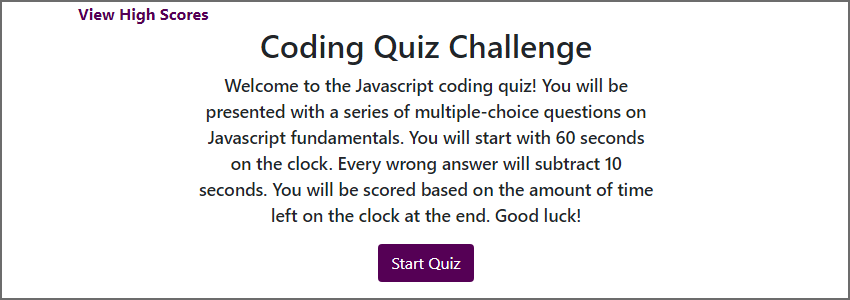
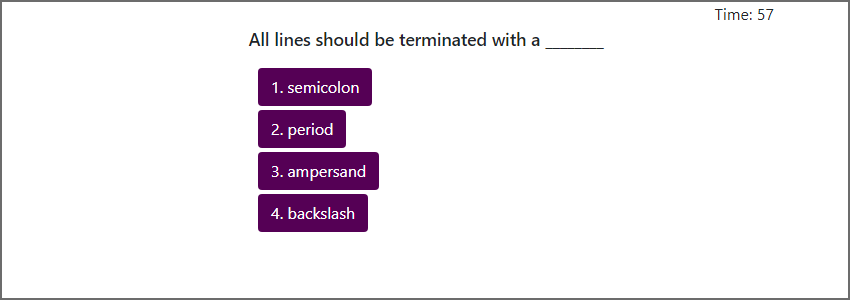

# code-quiz

## Description
A timed quiz on Javascript fundamentals. Users are asked a series of multiple-choice questions with a time-limit. Wrong answers are subtracted from the remaining time. The user is assigned a final score based on the time left on the clock when the quiz is over. The user then inputs their initials to be saved in a high scores list.

This is an exercise in assigning event functions, manipulating the page through the DOM API, and using local storage for persistent data. It is written as a single-page application.

## Screenshots
  

## Deployment
The website has been deployed on GitHub as http://malenchite.github.io/code-quiz

## Credits
Bootstrap courtesy of https://getbootstrap.com
